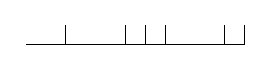
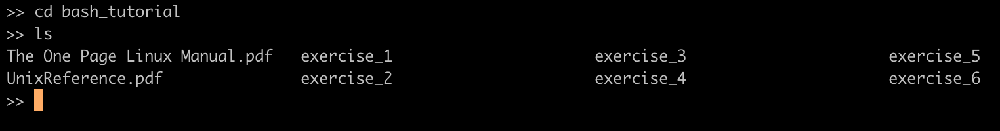

.. role:: raw-html(raw)
    :format: html

The Bash Command Line
=====================

**Note**:
This tutorial was adapted from the original `Bash tutorial <https://github.com/krother/bash_tutorial>`_
by **Dr. Kristian Rother (© 2010)**, which was published under the
Creative Commons Attribution Share-alike License 4.0. Adapted by **Paul Wlodkowski** (2019).

You can find the full sources on `https://github.com/krother/bash_tutorial <https://github.com/krother/bash_tutorial>`__.

Introduction
+++++++++++++++++++++++++

This tutorial introduces **bash**, a Unix shell and command line language
native to most Linux distributions as well as macOS. In this interactive
tutorial, you can learn commands to navigate directories,
manipulate files, and run programs.
If you have no previous experience with Unix-like systems or only know
a few commands but would like to know more, this tutorial is a great start.

**Note**: *This tutorial was originally prepared for Ubuntu Linux, but it works
on MacOS, Cygwin, Windows Subsystem for Linux (WSL), and Git bash,
given that Python 3 is installed on your system.*

Goal
+++++++++++++++++++++++++

In this tutorial, you will be looking for a word with 11 characters:

All characters are hidden in the exercises below.

Preparations
+++++++++++++++++++++++++

All exercises can be solved using a **Unix-like terminal** (including MacOS terminal)
as well as **Windows Subsystem for Linux (WSL)** and **git Bash** for Windows.

-  Open a bash terminal and navigate to an appropriate workspace / directory.
-  Clone the repository: ``git clone https://github.com/spicedacademy/bash_tutorial.git``
-  Once cloned, navigate into the *bash_tutorial* directory.

1. Directories and files
+++++++++++++++++++++++++

Navigating directories
---------------------------

The **first character** is hidden in a file somewhere in the ``exercise1/``
directory tree. Use the command

.. code:: bash

    cd <directory_name>

to move from one directory to the next. (do not type the pointy brackets,
just insert the directory name after the ``cd`` command.)

Once you've changed to a new directory, you can use

.. code:: bash

    ls

list the directory's contents. Look through subdirectories
until you find one with the name ``solution_1.1`` and list its contents.
If you went to a wrong directory, you can go back one level by typing:

.. code:: bash

    cd ..

or go back to your home folder:

.. code:: bash

    cd

Show a hidden file
-----------------------

Some files are not visible immediately. To see them, you need the
command

.. code:: bash

    ls -a

The **second character** is in the same directory as the first one, but
in a hidden file.

Execute a program
----------------------

Use `cd ..` to go back to the directory ``exercise_1/directoryB/``. When
listing its contents, you should see a **shell script** file called ``program.sh``.
To find the **third character**, you need to execute the program.
In bash, this can be done with the `source` command:

.. code:: bash

    source program.sh

Find out how big a file is
-------------------------------

Go to the folder ``exercise_1/directoryC/``. To find **the fourth
character**, you need to find out how big the text file in the directory
is. This is done with the command

.. code:: bash

    ls -l

In the table the command produces, you will find the file size (in bytes)
next to the date/time when the file was last modified.

Look up the file size (decimal value) in the
`Table of printable ASCII characters <https://en.wikipedia.org/wiki/ASCII#Printable_characters>`__
to obtain the corresponding character. For example, if the file size is 65 bytes,
then the fourth character would be the letter `A`.

.. figure:: images/ASCII-Table-wide.svg

*table of ASCII characters, Public Domain*

:raw-html:` `

**Hint**:
When typing names of directories or files,
press ``[TAB]`` after the first few characters.
Unix tries to guess what you are typing.

2. Edit text files
+++++++++++++++++++++++++

Please use ``cd ..`` to go back to the top directory of the tutorial
material. Then, change to the directory ``exercise_2``.

See what is in a text file
-------------------------------

In the directory *exercise\_2/*, you will find a text file
*solution\_2.1.txt*. The **fifth character** is inside that file. To see
its contents, use the command

.. code:: bash

    less <filename>

**Hint**:
Press ``q`` to leave the display mode.

Edit text files
--------------------

To get **character number six**, you will need to create a text file in
the ``exercise_2`` directory. On most Unix-like systems, you can do this
using the *nano* editor. To start using the nano editor directly, you can simply
run the ``nano`` command, or you can simultaneously create a new file:

.. code:: bash

    nano <filename>

After typing in something in the body of the file (e.g. the letters you have
found so far), you will need to save and exit the program. You'll notice options
at the bottom of the screen referencing the keyboard shortcuts needed for
interacting the the program. (Note that the ``^`` symbol means the *control key*).

The **sixth character** is the letter following the control key for
saving, or "writing out" a file in *nano*.

:raw-html:` `

3. Copy and remove files
+++++++++++++++++++++++++

Please navigate inside the ``exercise_3`` directory.

Create a directory and copy a file to it.
----------------------------------------------

To find **characters seven and eight**, create a directory named ``solution/``
and copy the files from the ``part1/`` and ``part2/`` directories into it.

For creating directories, use the command:

.. code:: bash

    mkdir <directory name>

To copy the contents of the ``part1/`` and ``part2/`` directories into
``solution/``, run the commands:

.. code:: bash

    cp part1/* solution/
    cp part2/* solution/

Type ``ls -l solution/*`` to points towards the solution.

:raw-html:` `

Removing files
-------------------

In the ``data`` directory, all files with an ``Y`` in their name need to be deleted.

To remove a file, use the command:

.. code:: bash

    rm <filename>

There are many such files to be deleted in the *data* directory. To
remove more than one file at once, you can use ``*`` symbol as a wildcard:

e.g. ``rm ju*`` will delete all of ``junk.txt, juniper.txt`` and
``june.docx``.

To get **characters nine and ten**, look at the files that remain after
deleting those that contain a ``Y``.

:raw-html:` `

**Hint:**

To remove an empty directory, you can use the ``rmdir <directory name>``
command, or ``rm -rf <directory name>`` to deletes a directory
with anything inside it.

:raw-html:` `

**Warning!**

On Unix, it is not possible to undelete files!
This makes removing files with the ``*`` symbol **very** dangerous,
because you could wipe out everything
with a single command
(e.g. if you type the wrong directory by accident).
Backups become an even better idea after learning this command.

4. Python Interpreter
+++++++++++++++++++++++++

Please go to the directory ``exercise_4``.

Running python scripts
------------------------

To find the final character, you will need to run the python script ``file.py``.
Luckily, python runs natively in the command line (e.g. bash terminal),
so running a python script can be done simply by invoking the python interpreter
followed by the name of the script:

.. code:: bash

    python file.py

The solution to the **final character** will be printed to the console.
